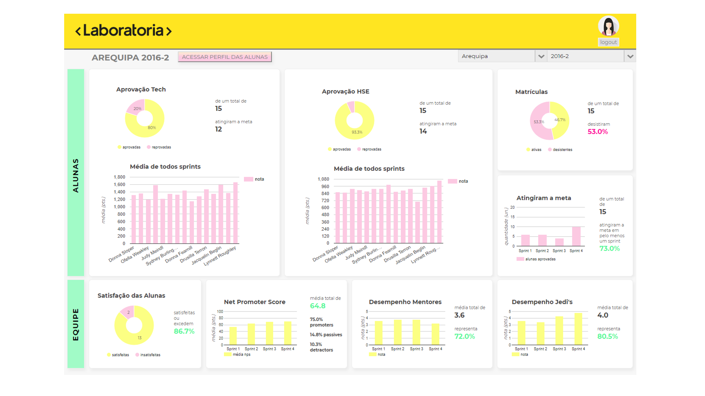

# Dashboard
A dashboard with data about Laboratoria's students. 

## Appearance

## Use
If you want to access, put the username *juliana* and the password *gatinhos*.

## Technology Stack
+ HTML5
+ CSS3
+ JavaScript 
+ [Google Charts](https://developers.google.com/chart/) 

## Oficial Roadmap

#### versão 3.0.0 (scheduled for January 2019)
+ Home page improvement.

#### version 2.0.0 (scheduled for November 2018)
+ Code refactoring (using ES6).

#### version 1.0.0 (released)
+ It is possible to visualize in graphs a series of data about all headquarters and classes of Laboratoria. In addition, in each class we present some specific data about the students, such as general average, photo and description of the profile.

